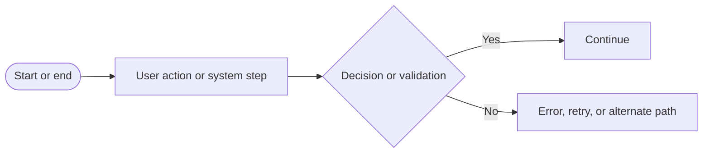
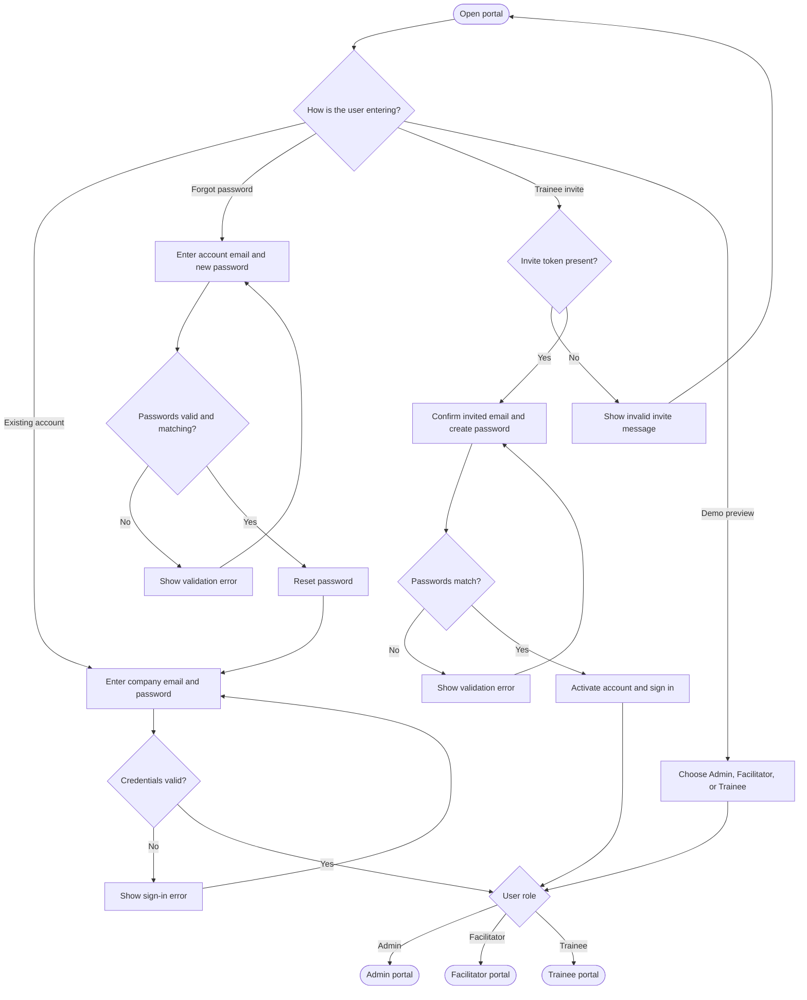
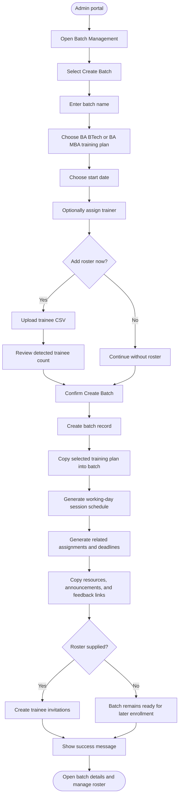
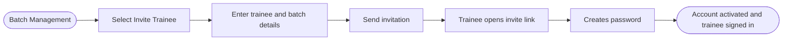
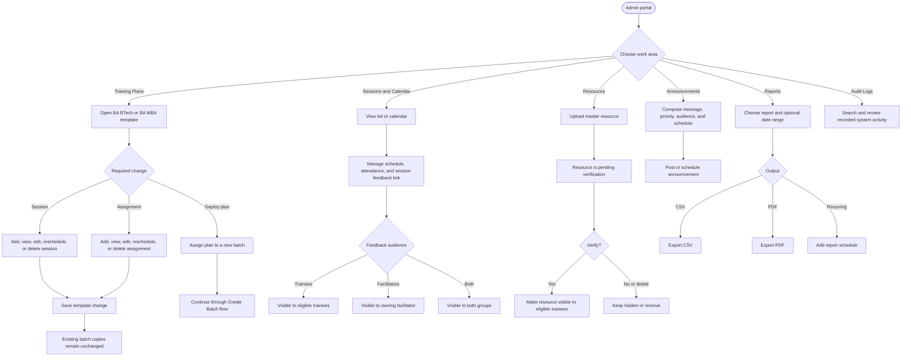
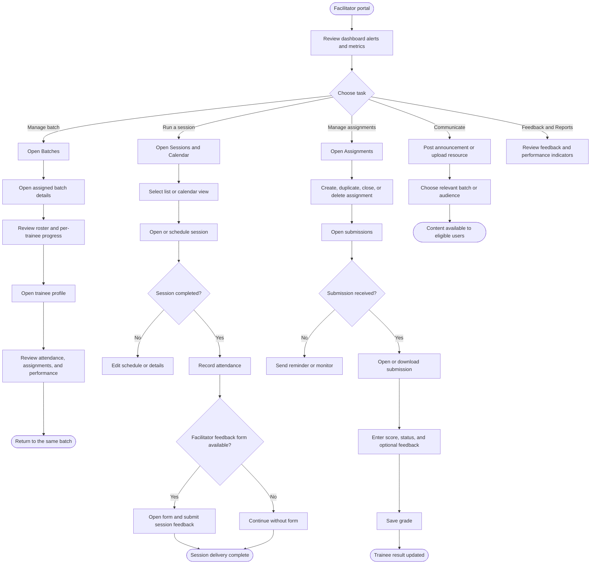
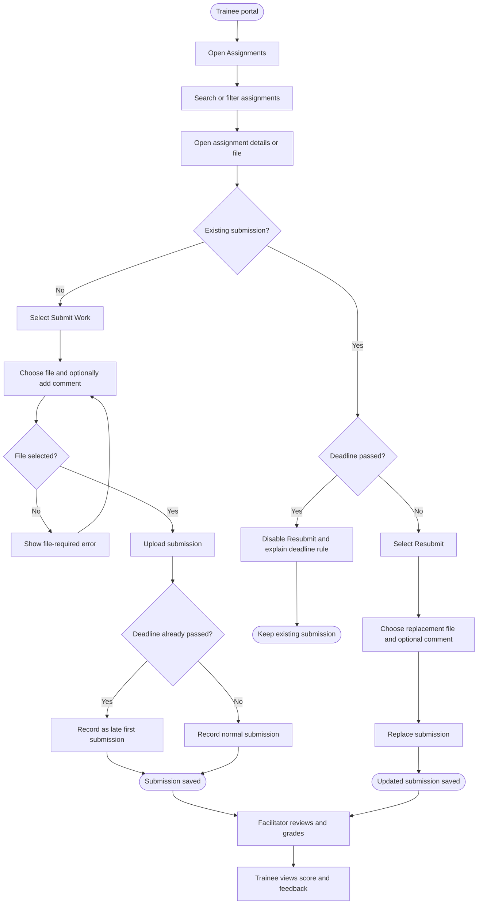
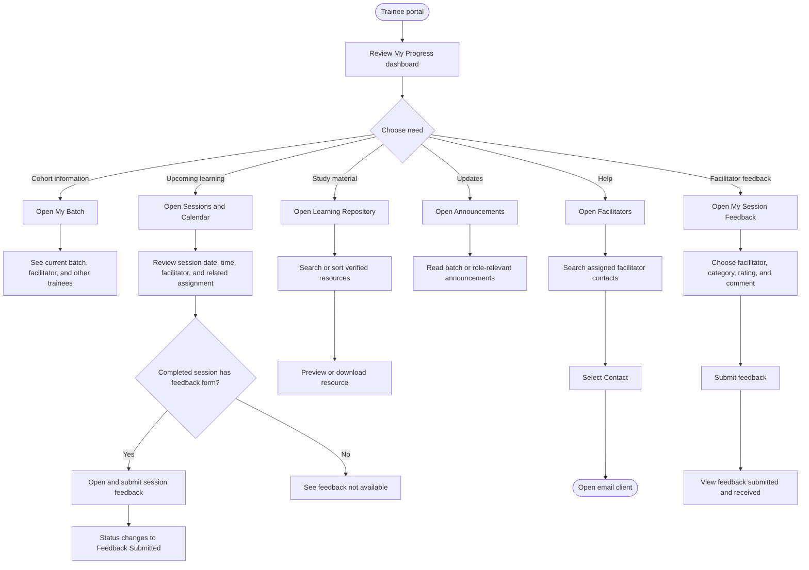
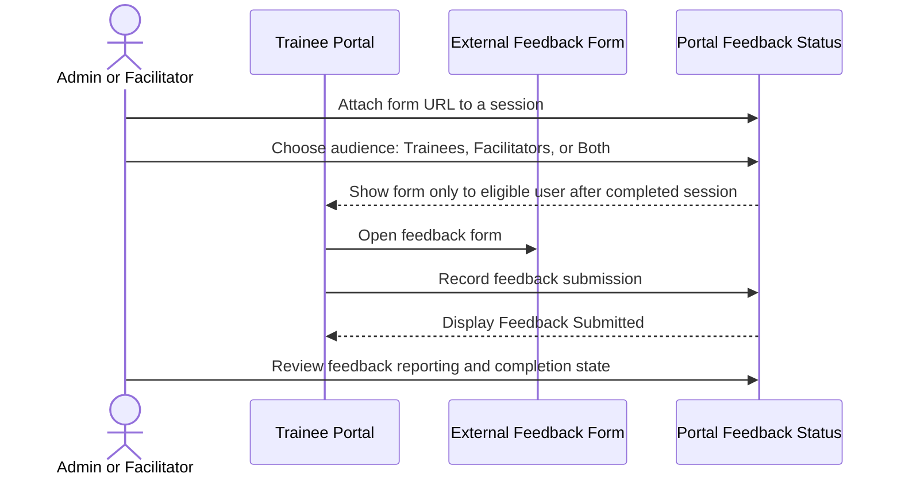
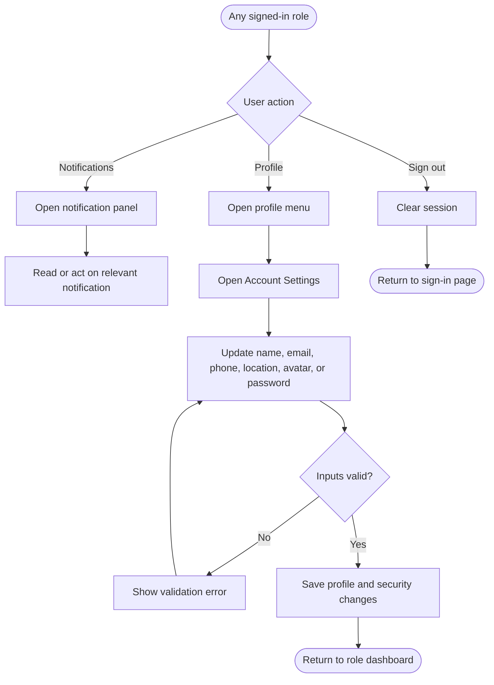

# Trainee Management Portal — User Flows

**Version:** 1.0  
**Prepared from:** the implemented React routes, role navigation, page actions, backend rules, and the verified project audit  
**Roles:** Admin, Facilitator, Trainee

## 1. Flow legend

## 2. Portal entry, authentication, and account activation

## 3. Admin — create and onboard a batch

This is the main business flow. A training-plan template is copied into the new batch; later batch edits do not change the original template.

### Admin — invite an individual trainee

## 4. Admin — manage training plans and portal operations

## 5. Facilitator — deliver training and monitor trainees

Facilitators can work only with their assigned batches and trainees.

## 6. Trainee — complete an assignment

Late first submissions are allowed. Replacing an existing submission is allowed only before the deadline.

## 7. Trainee — daily learning and support journey

## 8. Session-feedback lifecycle across roles

## 9. Shared account and exit flow

## 10. Role-access summary

| Capability | Admin | Facilitator | Trainee |
|---|:---:|:---:|:---:|
| View system-wide analytics | Yes | No | No |
| Create batches from training plans | Yes | No | No |
| Manage training-plan templates | Yes | No | No |
| View assigned/enrolled batches | All batches | Own batches | Enrolled batches |
| Create and manage assignments | Yes | Own batches | No |
| Submit assignments | No | No | Own assignments |
| Grade submissions | Yes | Own batches | No |
| Manage sessions and attendance | Yes | Own batches | View only |
| Attach session-feedback forms | Yes | Own sessions | No |
| Submit eligible session feedback | If applicable | Yes | Yes |
| Publish announcements/resources | Global | Own batches | View/download |
| Export reports and inspect audit logs | Yes | Limited reports | No |
| Update own account settings | Yes | Yes | Yes |

## 11. Important rules represented in these flows

- The portal has exactly two standard training plans: **BA BTech** and **BA MBA**.
- Batch creation generates an editable batch-specific copy of the selected plan.
- Weekends are skipped when the system generates the training schedule.
- Trainer assignment during batch creation is optional.
- Facilitators are limited to batches assigned to them; trainees are limited to batches in which they are enrolled.
- Session-feedback visibility depends on the selected audience and the user's relationship to the batch.
- A trainee may make a late first assignment submission, but cannot replace an existing submission after the deadline.
- Only verified resources are exposed to trainees.
- Demo mode uses sample data and does not represent a persistent production database.

