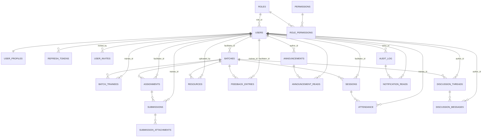

# Trainee Portal — Production Backend & Database Design

Status: **design only** — nothing in this document has been wired into the running app. The existing `backend/src` Express skeleton (in-memory `auth.service.ts`, plaintext passwords, invite-pending sentinel) is a throwaway prototype and is superseded by this design, not yet replaced.

## 1. Frontend data models actually in use

Read directly from `frontend/src/types/*.ts`, `frontend/src/store/*.ts`, `frontend/src/services/**`, `frontend/src/constants/permissions.ts`, and the existing `backend/src/services/auth.service.ts`. No unrelated UI files were inspected.

| Frontend type | File | Notes |
|---|---|---|
| `MockUser` / `MockUserRecord` | `types/user.ts`, `services/mockData/users.mock.ts` | id, name, email, password, role, active |
| `Role` | `types/role.ts` | `'admin' \| 'facilitator' \| 'trainee'` |
| `RoleProfile` | `types/profile.ts` | phone, location, avatar, company/department/idNumber/batch/course |
| `Batch` | `types/batch.ts` | program/track enums, `poc` (facilitator name), `members` (trainee names), 5 aggregate metric fields |
| `Assignment` + `Submission` | `types/assignment.ts` | Submission is nested in Assignment today; needs its own identity for grading/FKs |
| `Session` | `types/session.ts` | only aggregate `presentCount`/`absentCount`, no per-trainee record |
| `Resource` | `types/resource.ts` | file metadata only, no real upload today |
| `FeedbackEntry` | `types/feedback.ts` | |
| `Announcement` | `types/announcement.ts` | aggregate `readByCount`, no per-user tracking today |
| `DiscussionThread` + `DiscussionMessage` | `types/discussion.ts` | |
| `AuditLogEntry` | `types/auditLog.ts` | also powers the Notifications panel (`hooks/useNotifications.ts` slices `auditEntries`, tracks read-state in a client-only `Set` that resets on reload) |
| `ROLE_PERMISSIONS` | `constants/permissions.ts` | static role → permission-string map, 3 roles / 14 permission keys |
| invite flow | `backend/src/services/auth.service.ts`, `frontend/src/api/auth.ts` | trainee accounts start `active:false` / `password:'invite-pending'` until accepted |

**Explicitly not modeled:** `ToastVariant` (UI-only, never persisted). No entity was added beyond what these files reference.

**Normalization decisions** (frontend stores several fields as plain display-name strings, not IDs — the DB should not):
- `Batch.poc`, `Assignment.facilitator`, `Session.facilitator`, `Resource.uploadedBy`, `FeedbackEntry.trainee`/`facilitator`, `Announcement.author`, `Discussion*.author`, `Submission.traineeName` → all become real FK columns to `users.id`.
- `Batch.members: string[]` → `batch_trainees` join table.
- `Session.presentCount`/`absentCount` → derived from a normalized `attendance` table (per-trainee, per-session), not stored directly.
- `Batch.avgScore/completion/attendanceRate/submissionRate/feedbackRating/traineeCount` → all derivable aggregates; stored as raw columns they'd drift out of sync with the source tables, so they're computed via a view (`batch_metrics`, §2.9) instead of persisted.
- `Announcement.readByCount` → `announcement_reads` join table (per-user), because there's currently no real way to compute it correctly.
- Notification read-state → `notification_reads` join table against `audit_log`, replacing the client-only `Set` that forgets on every page reload.

## 2. PostgreSQL schema

```sql
CREATE EXTENSION IF NOT EXISTS pgcrypto; -- gen_random_uuid()
CREATE EXTENSION IF NOT EXISTS citext;   -- case-insensitive email

CREATE TYPE batch_program        AS ENUM ('BA', 'Data Engineering', 'AI ML', 'UI/UX');
CREATE TYPE batch_track          AS ENUM ('BTech', 'MBA');
CREATE TYPE batch_status         AS ENUM ('Active', 'Upcoming');
CREATE TYPE assignment_status    AS ENUM ('Draft', 'Open', 'Closed');
CREATE TYPE submission_status    AS ENUM ('Not Started', 'Under Review', 'Completed', 'Late');
CREATE TYPE session_platform     AS ENUM ('Google Meet', 'Microsoft Teams', 'Zoom', 'Other');
CREATE TYPE session_status       AS ENUM ('Upcoming', 'Live', 'Completed', 'Cancelled', 'Rescheduled');
CREATE TYPE attendance_status    AS ENUM ('Present', 'Absent', 'Late', 'Excused');
CREATE TYPE announcement_priority AS ENUM ('Normal', 'Important', 'Critical');
CREATE TYPE discussion_role      AS ENUM ('admin', 'facilitator', 'trainee');
CREATE TYPE invite_status        AS ENUM ('Pending', 'Accepted', 'Expired', 'Revoked');
```

Enum values match the frontend's literal unions exactly (`batch_status` intentionally has no `'Completed'`/`'Archived'` value — the frontend doesn't use one; a batch's terminal state is instead handled by `archived_at`, so no invented enum value was needed).

### 2.1 Auth & identity

```sql
CREATE TABLE roles (
  id          SMALLSERIAL PRIMARY KEY,
  name        TEXT NOT NULL UNIQUE,          -- 'admin' | 'facilitator' | 'trainee'
  description TEXT
);

CREATE TABLE permissions (
  id          SMALLSERIAL PRIMARY KEY,
  key         TEXT NOT NULL UNIQUE,          -- e.g. 'manage_batches'
  description TEXT
);

CREATE TABLE role_permissions (              -- implements ROLE_PERMISSIONS map from constants/permissions.ts
  role_id       SMALLINT NOT NULL REFERENCES roles(id) ON DELETE CASCADE,
  permission_id SMALLINT NOT NULL REFERENCES permissions(id) ON DELETE CASCADE,
  PRIMARY KEY (role_id, permission_id)
);

CREATE TABLE users (
  id             UUID PRIMARY KEY DEFAULT gen_random_uuid(),
  name           TEXT NOT NULL,
  email          CITEXT NOT NULL,
  password_hash  TEXT NOT NULL,
  role_id        SMALLINT NOT NULL REFERENCES roles(id) ON DELETE RESTRICT,
  is_active      BOOLEAN NOT NULL DEFAULT true,
  last_login_at  TIMESTAMPTZ,
  created_at     TIMESTAMPTZ NOT NULL DEFAULT now(),
  updated_at     TIMESTAMPTZ NOT NULL DEFAULT now(),
  deleted_at     TIMESTAMPTZ,
  CONSTRAINT users_email_unique UNIQUE (email)
);
CREATE INDEX idx_users_role_id ON users(role_id) WHERE deleted_at IS NULL;
CREATE INDEX idx_users_active  ON users(is_active) WHERE deleted_at IS NULL;

CREATE TABLE user_profiles (                 -- 1:1 extension, matches RoleProfile
  user_id             UUID PRIMARY KEY REFERENCES users(id) ON DELETE CASCADE,
  phone               TEXT,
  location            TEXT,
  company             TEXT,
  department          TEXT,
  id_number           TEXT,                  -- employee id / trainee id
  avatar_storage_key  TEXT,
  avatar_mime_type    TEXT,
  avatar_size_bytes   INTEGER,
  avatar_updated_at   TIMESTAMPTZ,
  updated_at          TIMESTAMPTZ NOT NULL DEFAULT now()
);

CREATE TABLE user_invites (                  -- replaces the 'invite-pending' password sentinel
  id          UUID PRIMARY KEY DEFAULT gen_random_uuid(),
  email       CITEXT NOT NULL,
  role_id     SMALLINT NOT NULL REFERENCES roles(id),
  invited_by  UUID REFERENCES users(id) ON DELETE SET NULL,
  token_hash  TEXT NOT NULL,
  status      invite_status NOT NULL DEFAULT 'Pending',
  expires_at  TIMESTAMPTZ NOT NULL,
  accepted_at TIMESTAMPTZ,
  created_at  TIMESTAMPTZ NOT NULL DEFAULT now(),
  CONSTRAINT user_invites_token_unique UNIQUE (token_hash)
);
CREATE INDEX idx_user_invites_email_status ON user_invites(email, status);

CREATE TABLE refresh_tokens (                -- backs the "remember me" long/short session split already in utils/authSession.ts
  id           UUID PRIMARY KEY DEFAULT gen_random_uuid(),
  user_id      UUID NOT NULL REFERENCES users(id) ON DELETE CASCADE,
  token_hash   TEXT NOT NULL,
  user_agent   TEXT,
  ip_address   INET,
  remember_me  BOOLEAN NOT NULL DEFAULT false,
  expires_at   TIMESTAMPTZ NOT NULL,
  revoked_at   TIMESTAMPTZ,
  created_at   TIMESTAMPTZ NOT NULL DEFAULT now(),
  CONSTRAINT refresh_tokens_token_unique UNIQUE (token_hash)
);
CREATE INDEX idx_refresh_tokens_user_id ON refresh_tokens(user_id) WHERE revoked_at IS NULL;
```

**Password hashing:** `argon2id` (via the `argon2` npm package) — memory-hard, current OWASP recommendation, output is a self-describing PHC string so `password_hash` needs no separate algorithm/salt columns. `bcrypt` (cost 12) is an acceptable fallback if `argon2`'s native build is a deployment problem.

**Sessions:** stateless JWT access tokens (short-lived, ~15 min) + the `refresh_tokens` table above for rotation/revocation (supports "log out of all devices" and matches the frontend's existing dual localStorage/sessionStorage "remember me" behavior via the `remember_me` flag and differing `expires_at`).

### 2.2 Batches

```sql
CREATE TABLE batches (
  id              UUID PRIMARY KEY DEFAULT gen_random_uuid(),
  code            TEXT NOT NULL,             -- e.g. 'ba-btech', human-friendly slug
  name            TEXT NOT NULL,
  program         batch_program NOT NULL,
  track           batch_track NOT NULL,
  facilitator_id  UUID REFERENCES users(id) ON DELETE SET NULL,  -- POC
  start_month     DATE,
  status          batch_status NOT NULL DEFAULT 'Upcoming',
  archived_at     TIMESTAMPTZ,
  created_at      TIMESTAMPTZ NOT NULL DEFAULT now(),
  updated_at      TIMESTAMPTZ NOT NULL DEFAULT now(),
  deleted_at      TIMESTAMPTZ,
  CONSTRAINT batches_code_unique UNIQUE (code)
);
CREATE INDEX idx_batches_facilitator_id ON batches(facilitator_id) WHERE deleted_at IS NULL;
CREATE INDEX idx_batches_status ON batches(status) WHERE deleted_at IS NULL;

CREATE TABLE batch_trainees (
  batch_id    UUID NOT NULL REFERENCES batches(id) ON DELETE CASCADE,
  trainee_id  UUID NOT NULL REFERENCES users(id) ON DELETE CASCADE,
  enrolled_at TIMESTAMPTZ NOT NULL DEFAULT now(),
  removed_at  TIMESTAMPTZ,
  PRIMARY KEY (batch_id, trainee_id)
);
CREATE INDEX idx_batch_trainees_trainee_id ON batch_trainees(trainee_id);
```

### 2.3 Assignments & submissions

```sql
CREATE TABLE assignments (
  id              UUID PRIMARY KEY DEFAULT gen_random_uuid(),
  batch_id        UUID NOT NULL REFERENCES batches(id) ON DELETE CASCADE,
  facilitator_id  UUID NOT NULL REFERENCES users(id) ON DELETE RESTRICT,
  title           TEXT NOT NULL,
  description     TEXT NOT NULL DEFAULT '',
  status          assignment_status NOT NULL DEFAULT 'Draft',
  deadline        TIMESTAMPTZ NOT NULL,
  created_at      TIMESTAMPTZ NOT NULL DEFAULT now(),
  updated_at      TIMESTAMPTZ NOT NULL DEFAULT now(),
  deleted_at      TIMESTAMPTZ
);
CREATE INDEX idx_assignments_batch_id ON assignments(batch_id) WHERE deleted_at IS NULL;
CREATE INDEX idx_assignments_deadline ON assignments(deadline) WHERE deleted_at IS NULL;

CREATE TABLE submissions (
  id             UUID PRIMARY KEY DEFAULT gen_random_uuid(),
  assignment_id  UUID NOT NULL REFERENCES assignments(id) ON DELETE CASCADE,
  trainee_id     UUID NOT NULL REFERENCES users(id) ON DELETE CASCADE,
  status         submission_status NOT NULL DEFAULT 'Not Started',
  submitted_at   TIMESTAMPTZ,
  grade          NUMERIC(5,2) CHECK (grade IS NULL OR (grade BETWEEN 0 AND 100)),
  feedback       TEXT,
  created_at     TIMESTAMPTZ NOT NULL DEFAULT now(),
  updated_at     TIMESTAMPTZ NOT NULL DEFAULT now(),
  CONSTRAINT submissions_assignment_trainee_unique UNIQUE (assignment_id, trainee_id)
);
CREATE INDEX idx_submissions_trainee_id ON submissions(trainee_id);
CREATE INDEX idx_submissions_status ON submissions(status);

CREATE TABLE submission_attachments (        -- new capability — see §4 frontend gap
  id                 UUID PRIMARY KEY DEFAULT gen_random_uuid(),
  submission_id      UUID NOT NULL REFERENCES submissions(id) ON DELETE CASCADE,
  original_filename  TEXT NOT NULL,
  storage_key        TEXT NOT NULL,
  mime_type          TEXT NOT NULL,
  size_bytes         INTEGER NOT NULL CHECK (size_bytes >= 0),
  uploaded_at        TIMESTAMPTZ NOT NULL DEFAULT now(),
  CONSTRAINT submission_attachments_storage_key_unique UNIQUE (storage_key)
);
CREATE INDEX idx_submission_attachments_submission_id ON submission_attachments(submission_id);
```

`submissions` has no soft delete — a trainee always has at most one submission row per assignment (enforced by the unique constraint); resetting it is a normal state transition (`status` back to `'Not Started'`), not a deletion.

### 2.4 Sessions & attendance

```sql
CREATE TABLE sessions (
  id              UUID PRIMARY KEY DEFAULT gen_random_uuid(),
  batch_id        UUID NOT NULL REFERENCES batches(id) ON DELETE CASCADE,
  facilitator_id  UUID NOT NULL REFERENCES users(id) ON DELETE RESTRICT,
  title           TEXT NOT NULL,
  scheduled_at    TIMESTAMPTZ NOT NULL,      -- combines the frontend's separate date+time fields
  platform        session_platform NOT NULL DEFAULT 'Other',
  meeting_link    TEXT,
  status          session_status NOT NULL DEFAULT 'Upcoming',
  created_at      TIMESTAMPTZ NOT NULL DEFAULT now(),
  updated_at      TIMESTAMPTZ NOT NULL DEFAULT now(),
  deleted_at      TIMESTAMPTZ
);
CREATE INDEX idx_sessions_batch_id ON sessions(batch_id) WHERE deleted_at IS NULL;
CREATE INDEX idx_sessions_scheduled_at ON sessions(scheduled_at) WHERE deleted_at IS NULL;

CREATE TABLE attendance (
  id          UUID PRIMARY KEY DEFAULT gen_random_uuid(),
  session_id  UUID NOT NULL REFERENCES sessions(id) ON DELETE CASCADE,
  trainee_id  UUID NOT NULL REFERENCES users(id) ON DELETE CASCADE,
  status      attendance_status NOT NULL,
  marked_by   UUID REFERENCES users(id) ON DELETE SET NULL,
  marked_at   TIMESTAMPTZ NOT NULL DEFAULT now(),
  CONSTRAINT attendance_session_trainee_unique UNIQUE (session_id, trainee_id)
);
CREATE INDEX idx_attendance_trainee_id ON attendance(trainee_id);
```

### 2.5 Resources

```sql
CREATE TABLE resources (
  id             UUID PRIMARY KEY DEFAULT gen_random_uuid(),
  batch_id       UUID REFERENCES batches(id) ON DELETE CASCADE, -- NULL = frontend's 'All'
  title          TEXT NOT NULL,
  category       TEXT NOT NULL,
  version        TEXT NOT NULL DEFAULT 'v1.0',
  storage_key    TEXT NOT NULL,
  mime_type      TEXT NOT NULL,
  size_bytes     BIGINT NOT NULL CHECK (size_bytes >= 0),
  download_count INTEGER NOT NULL DEFAULT 0,
  verified       BOOLEAN NOT NULL DEFAULT false,
  uploaded_by    UUID NOT NULL REFERENCES users(id) ON DELETE RESTRICT,
  created_at     TIMESTAMPTZ NOT NULL DEFAULT now(),
  updated_at     TIMESTAMPTZ NOT NULL DEFAULT now(),
  deleted_at     TIMESTAMPTZ,
  CONSTRAINT resources_storage_key_unique UNIQUE (storage_key)
);
CREATE INDEX idx_resources_batch_id ON resources(batch_id) WHERE deleted_at IS NULL;
CREATE INDEX idx_resources_category ON resources(category) WHERE deleted_at IS NULL;
```

### 2.6 Feedback

```sql
CREATE TABLE feedback_entries (
  id              UUID PRIMARY KEY DEFAULT gen_random_uuid(),
  batch_id        UUID NOT NULL REFERENCES batches(id) ON DELETE CASCADE,
  trainee_id      UUID NOT NULL REFERENCES users(id) ON DELETE CASCADE,
  facilitator_id  UUID NOT NULL REFERENCES users(id) ON DELETE CASCADE,
  category        TEXT NOT NULL,
  rating          SMALLINT NOT NULL CHECK (rating BETWEEN 1 AND 5),
  comment         TEXT,
  created_at      TIMESTAMPTZ NOT NULL DEFAULT now()
);
CREATE INDEX idx_feedback_batch_id ON feedback_entries(batch_id);
CREATE INDEX idx_feedback_trainee_id ON feedback_entries(trainee_id);
```

Feedback rows are never edited or deleted in the frontend (append-only), so there's no `updated_at`/`deleted_at`.

### 2.7 Announcements & discussions

```sql
CREATE TABLE announcements (
  id             UUID PRIMARY KEY DEFAULT gen_random_uuid(),
  author_id      UUID NOT NULL REFERENCES users(id) ON DELETE RESTRICT,
  title          TEXT NOT NULL,
  message        TEXT NOT NULL,
  priority       announcement_priority NOT NULL DEFAULT 'Normal',
  audience       TEXT NOT NULL,             -- 'All' | batch code | role name, matches frontend's free-form audience field
  pinned         BOOLEAN NOT NULL DEFAULT false,
  scheduled_for  TIMESTAMPTZ,
  expires_at     TIMESTAMPTZ,
  created_at     TIMESTAMPTZ NOT NULL DEFAULT now(),
  updated_at     TIMESTAMPTZ NOT NULL DEFAULT now(),
  deleted_at     TIMESTAMPTZ
);
CREATE INDEX idx_announcements_pinned ON announcements(pinned) WHERE deleted_at IS NULL;

CREATE TABLE announcement_reads (
  announcement_id  UUID NOT NULL REFERENCES announcements(id) ON DELETE CASCADE,
  user_id          UUID NOT NULL REFERENCES users(id) ON DELETE CASCADE,
  read_at          TIMESTAMPTZ NOT NULL DEFAULT now(),
  PRIMARY KEY (announcement_id, user_id)
);

CREATE TABLE discussion_threads (
  id          UUID PRIMARY KEY DEFAULT gen_random_uuid(),
  batch_id    UUID NOT NULL REFERENCES batches(id) ON DELETE CASCADE,
  author_id   UUID NOT NULL REFERENCES users(id) ON DELETE CASCADE,
  title       TEXT NOT NULL,
  created_at  TIMESTAMPTZ NOT NULL DEFAULT now(),
  updated_at  TIMESTAMPTZ NOT NULL DEFAULT now(),
  deleted_at  TIMESTAMPTZ
);
CREATE INDEX idx_discussion_threads_batch_id ON discussion_threads(batch_id) WHERE deleted_at IS NULL;

CREATE TABLE discussion_messages (
  id                    UUID PRIMARY KEY DEFAULT gen_random_uuid(),
  thread_id             UUID NOT NULL REFERENCES discussion_threads(id) ON DELETE CASCADE,
  author_id             UUID NOT NULL REFERENCES users(id) ON DELETE CASCADE,
  author_role_snapshot  discussion_role NOT NULL, -- role at post time, preserved even if the user's role later changes
  body                  TEXT NOT NULL,
  created_at            TIMESTAMPTZ NOT NULL DEFAULT now(),
  deleted_at            TIMESTAMPTZ
);
CREATE INDEX idx_discussion_messages_thread_id ON discussion_messages(thread_id) WHERE deleted_at IS NULL;
```

### 2.8 Audit log & notifications

```sql
CREATE TABLE audit_log (                     -- append-only, immutable — no updated_at/deleted_at
  id              UUID PRIMARY KEY DEFAULT gen_random_uuid(),
  occurred_at     TIMESTAMPTZ NOT NULL DEFAULT now(),
  event_type      TEXT NOT NULL,
  message         TEXT NOT NULL,
  actor_id        UUID REFERENCES users(id) ON DELETE SET NULL,
  module          TEXT NOT NULL,
  previous_value  TEXT,
  new_value       TEXT,
  ip_address      INET
);
CREATE INDEX idx_audit_log_occurred_at ON audit_log(occurred_at DESC);
CREATE INDEX idx_audit_log_actor_id ON audit_log(actor_id);
CREATE INDEX idx_audit_log_module ON audit_log(module);

CREATE TABLE notification_reads (            -- replaces useNotifications' client-only Set<string>
  audit_log_id  UUID NOT NULL REFERENCES audit_log(id) ON DELETE CASCADE,
  user_id       UUID NOT NULL REFERENCES users(id) ON DELETE CASCADE,
  read_at       TIMESTAMPTZ NOT NULL DEFAULT now(),
  PRIMARY KEY (audit_log_id, user_id)
);
```

### 2.9 Derived-metric views (not stored columns)

```sql
CREATE VIEW batch_metrics AS
SELECT
  b.id AS batch_id,
  (SELECT COUNT(*) FROM batch_trainees bt WHERE bt.batch_id = b.id AND bt.removed_at IS NULL) AS trainee_count,
  (SELECT ROUND(AVG(s.grade), 2) FROM submissions s JOIN assignments a ON a.id = s.assignment_id
     WHERE a.batch_id = b.id AND s.grade IS NOT NULL) AS avg_score,
  (SELECT ROUND(100.0 * COUNT(*) FILTER (WHERE s.status = 'Completed') / NULLIF(COUNT(*), 0), 2)
     FROM submissions s JOIN assignments a ON a.id = s.assignment_id WHERE a.batch_id = b.id) AS completion_pct,
  (SELECT ROUND(100.0 * COUNT(*) FILTER (WHERE att.status = 'Present') / NULLIF(COUNT(*), 0), 2)
     FROM attendance att JOIN sessions se ON se.id = att.session_id WHERE se.batch_id = b.id) AS attendance_rate,
  (SELECT ROUND(100.0 * COUNT(*) FILTER (WHERE s.status IN ('Completed','Under Review','Late')) / NULLIF(COUNT(*), 0), 2)
     FROM submissions s JOIN assignments a ON a.id = s.assignment_id WHERE a.batch_id = b.id) AS submission_rate,
  (SELECT ROUND(AVG(f.rating), 2) FROM feedback_entries f WHERE f.batch_id = b.id) AS feedback_rating
FROM batches b;

CREATE VIEW session_attendance_summary AS
SELECT session_id,
  COUNT(*) FILTER (WHERE status = 'Present') AS present_count,
  COUNT(*) FILTER (WHERE status = 'Absent')  AS absent_count
FROM attendance
GROUP BY session_id;
```

At real scale these become materialized views refreshed on a schedule/trigger rather than plain views; not needed at this project's size.

## 3. Relationships

Only relationships the current feature set actually needs:

- **User ↔ Role**: many-to-one (`users.role_id`). Role → Permission is many-to-many via `role_permissions`.
- **User ↔ UserProfile**: one-to-one.
- **Facilitator ↔ Batch**: one-to-many (`batches.facilitator_id`, one POC per batch — matches current data; no co-facilitator concept exists today).
- **Trainee ↔ Batch**: many-to-many via `batch_trainees`.
- **Batch ↔ Assignment**: one-to-many.
- **Assignment ↔ Submission**: one-to-many, unique per `(assignment_id, trainee_id)`.
- **Submission ↔ SubmissionAttachment**: one-to-many.
- **Batch ↔ Session**: one-to-many.
- **Session ↔ Attendance**: one-to-many, unique per `(session_id, trainee_id)`.
- **Batch ↔ Resource**: one-to-many (nullable = global resource).
- **Batch/Trainee/Facilitator ↔ FeedbackEntry**: each feedback entry many-to-one on all three.
- **User ↔ Announcement**: author, one-to-many; **User ↔ Announcement** read state: many-to-many via `announcement_reads`.
- **Batch ↔ DiscussionThread ↔ DiscussionMessage**: one-to-many, one-to-many.
- **User ↔ AuditLogEntry**: actor, one-to-many; **User ↔ AuditLogEntry** read state: many-to-many via `notification_reads`.

### Mermaid ER diagram



## 4. File storage metadata

Files themselves live in object storage (S3 / Azure Blob / disk in dev) — Postgres stores only metadata, and each of the three use cases gets typed columns rather than a generic polymorphic `files` table, so every reference stays a real foreign key:

| Use case | Where the metadata lives |
|---|---|
| Assignment uploads | `submission_attachments` (§2.3) — one-to-many, since a submission may have multiple files |
| Learning resources | `resources.storage_key` / `mime_type` / `size_bytes` (§2.5) — 1:1, the resource *is* the file record |
| Profile pictures | `user_profiles.avatar_storage_key` / `avatar_mime_type` / `avatar_size_bytes` (§2.1) — 1:1 |

**Gap:** the current `Submission` type has no file field at all — trainees can't attach anything today. Real file upload is new capability this design adds (see §7 frontend changes).

## 5. REST API structure

No implementation — routes and purpose only.

```
/auth
  POST   /auth/login
  POST   /auth/logout
  POST   /auth/refresh
  POST   /auth/invite                    (admin)
  POST   /auth/invite/accept
  POST   /auth/forgot-password
  POST   /auth/reset-password            (authenticated)

/users
  GET    /users                          (admin, filter by role)
  GET    /users/me
  PATCH  /users/me
  GET    /users/:id
  PATCH  /users/:id                      (admin)
  DELETE /users/:id                      (soft delete, admin)
  GET    /users/:id/profile
  PATCH  /users/:id/profile

/batches
  GET    /batches
  POST   /batches                        (admin)
  GET    /batches/:id
  PATCH  /batches/:id
  DELETE /batches/:id                    (soft delete/archive)
  GET    /batches/:id/metrics
  GET    /batches/:id/trainees
  POST   /batches/:id/trainees
  DELETE /batches/:id/trainees/:traineeId

/assignments
  GET    /assignments?batchId=
  POST   /assignments                    (facilitator)
  GET    /assignments/:id
  PATCH  /assignments/:id
  DELETE /assignments/:id

/submissions
  GET    /assignments/:id/submissions
  POST   /assignments/:id/submissions    (trainee, multipart)
  GET    /submissions/:id
  PATCH  /submissions/:id                (facilitator: grade/feedback)
  POST   /submissions/:id/attachments
  GET    /submissions/:id/attachments/:attachmentId

/sessions
  GET    /sessions?batchId=
  POST   /sessions                       (facilitator)
  GET    /sessions/:id
  PATCH  /sessions/:id
  DELETE /sessions/:id

/attendance
  GET    /sessions/:id/attendance
  PUT    /sessions/:id/attendance        (bulk mark, facilitator)
  PATCH  /attendance/:id

/resources
  GET    /resources?batchId=&category=
  POST   /resources                      (facilitator, multipart)
  GET    /resources/:id
  GET    /resources/:id/download
  PATCH  /resources/:id
  DELETE /resources/:id

/feedback
  GET    /feedback?batchId=&traineeId=
  POST   /feedback                       (facilitator)
  GET    /feedback/:id

/announcements
  GET    /announcements
  POST   /announcements                  (admin)
  GET    /announcements/:id
  PATCH  /announcements/:id
  DELETE /announcements/:id
  POST   /announcements/:id/read

/discussions
  GET    /discussions?batchId=
  POST   /discussions
  GET    /discussions/:id
  POST   /discussions/:id/messages
  DELETE /discussions/:id/messages/:messageId

/audit-log
  GET    /audit-log?module=&actorId=     (requires view_audit_log permission)

/notifications
  GET    /notifications
  POST   /notifications/:auditLogId/read
  POST   /notifications/read-all
```

## 6. Express backend folder structure

```
backend/
  src/
    app.ts                      (existing — Express app wiring)
    index.ts                    (existing — server bootstrap)
    config/
      env.ts                    (typed env var loader)
      db.ts                     (Prisma client singleton)
    routes/
      auth.routes.ts
      users.routes.ts
      batches.routes.ts
      assignments.routes.ts
      submissions.routes.ts
      sessions.routes.ts
      attendance.routes.ts
      resources.routes.ts
      feedback.routes.ts
      announcements.routes.ts
      discussions.routes.ts
      auditLog.routes.ts
      notifications.routes.ts
      health.routes.ts          (existing)
    controllers/                (thin: parse req -> call service -> shape res)
      auth.controller.ts        (existing, to be rewritten against real DB)
      <one per resource, mirroring routes/>
    services/                   (business logic — existing pattern, e.g. auth.service.ts)
      <one per resource>
    middleware/
      errorHandler.ts           (existing)
      requireAuth.ts            (verifies JWT)
      requireRole.ts            (permission/role gate, mirrors frontend's RequireAuth)
      upload.ts                 (multer config for assignment/resource/avatar uploads)
      rateLimiter.ts
    validation/                 (zod schemas, one per resource; request bodies validated before hitting controllers)
    prisma/
      schema.prisma
      migrations/
    types/
      user.ts                   (existing, to be expanded)
      <request/response DTOs per resource>
    utils/
      password.ts                (argon2 hash/verify)
      tokens.ts                  (JWT sign/verify, refresh rotation)
      pagination.ts
      logger.ts
  tests/
    <mirrors src/ for unit/integration tests>
```

## 7. Prisma vs Sequelize

**Recommendation: Prisma.**

| | Prisma | Sequelize |
|---|---|---|
| TypeScript fit | Generated client is fully typed from `schema.prisma` — matches this project's already-strict TS frontend/backend | Needs `sequelize-typescript` decorators for comparable type safety; more boilerplate |
| Migrations | `prisma migrate dev` — declarative, versioned, diffable | Hand-written migration files, more manual and more error-prone to keep in sync with models |
| Schema as source of truth | One `schema.prisma` file mirrors this document almost 1:1 | Models and migrations can drift apart over time |
| Learning curve / team size | Simpler for a small team maintaining both a strict-TS frontend and backend | More flexible for complex raw-SQL-heavy legacy migrations, not a factor here (greenfield DB) |
| Real-time readiness | Client integrates cleanly with a WS/subscription layer sitting alongside it | No inherent advantage either way |

Given a strict-TypeScript codebase throughout, a brand-new database (no legacy schema to accommodate), and the stated goal of future real-time features, Prisma's type-safe generated client and first-class migration tooling are the better fit with less boilerplate.

### Prisma schema (translation of §2, same 22 tables)

```prisma
datasource db {
  provider = "postgresql"
  url      = env("DATABASE_URL")
}

generator client {
  provider = "prisma-client-js"
}

enum Role_ { admin facilitator trainee } // discussion_role / author_role_snapshot
enum BatchProgram { BA DataEngineering AIML UIUX }
enum BatchTrack { BTech MBA }
enum BatchStatus { Active Upcoming }
enum AssignmentStatus { Draft Open Closed }
enum SubmissionStatus { NotStarted UnderReview Completed Late }
enum SessionPlatform { GoogleMeet MicrosoftTeams Zoom Other }
enum SessionStatus { Upcoming Live Completed Cancelled Rescheduled }
enum AttendanceStatus { Present Absent Late Excused }
enum AnnouncementPriority { Normal Important Critical }
enum InviteStatus { Pending Accepted Expired Revoked }

model Role {
  id          Int      @id @default(autoincrement())
  name        String   @unique
  description String?
  users       User[]
  permissions RolePermission[]
}

model Permission {
  id          Int      @id @default(autoincrement())
  key         String   @unique
  description String?
  roles       RolePermission[]
}

model RolePermission {
  roleId       Int
  permissionId Int
  role         Role       @relation(fields: [roleId], references: [id], onDelete: Cascade)
  permission   Permission @relation(fields: [permissionId], references: [id], onDelete: Cascade)
  @@id([roleId, permissionId])
}

model User {
  id                    String    @id @default(uuid())
  name                  String
  email                 String    @unique
  passwordHash          String
  roleId                Int
  role                  Role      @relation(fields: [roleId], references: [id])
  isActive              Boolean   @default(true)
  lastLoginAt           DateTime?
  createdAt             DateTime  @default(now())
  updatedAt             DateTime  @updatedAt
  deletedAt             DateTime?
  profile               UserProfile?
  refreshTokens         RefreshToken[]
  batchesAsFacilitator  Batch[]   @relation("BatchFacilitator")
  batchEnrollments      BatchTrainee[]
  assignmentsCreated    Assignment[]
  submissions           Submission[]
  sessionsAsFacilitator Session[]
  attendanceMarked      Attendance[] @relation("AttendanceMarkedBy")
  attendanceRecords     Attendance[] @relation("AttendanceTrainee")
  resourcesUploaded     Resource[]
  feedbackAsTrainee     FeedbackEntry[] @relation("FeedbackTrainee")
  feedbackAsFacilitator FeedbackEntry[] @relation("FeedbackFacilitator")
  announcements         Announcement[]
  announcementReads     AnnouncementRead[]
  discussionThreads     DiscussionThread[]
  discussionMessages    DiscussionMessage[]
  auditLogEntries       AuditLog[]
  notificationReads     NotificationRead[]
}

model UserProfile {
  userId            String   @id
  user              User     @relation(fields: [userId], references: [id], onDelete: Cascade)
  phone             String?
  location          String?
  company           String?
  department        String?
  idNumber          String?
  avatarStorageKey  String?
  avatarMimeType    String?
  avatarSizeBytes   Int?
  avatarUpdatedAt   DateTime?
  updatedAt         DateTime @updatedAt
}

model UserInvite {
  id         String       @id @default(uuid())
  email      String
  roleId     Int
  invitedBy  String?
  tokenHash  String       @unique
  status     InviteStatus @default(Pending)
  expiresAt  DateTime
  acceptedAt DateTime?
  createdAt  DateTime     @default(now())
}

model RefreshToken {
  id         String    @id @default(uuid())
  userId     String
  user       User      @relation(fields: [userId], references: [id], onDelete: Cascade)
  tokenHash  String    @unique
  userAgent  String?
  ipAddress  String?
  rememberMe Boolean   @default(false)
  expiresAt  DateTime
  revokedAt  DateTime?
  createdAt  DateTime  @default(now())
}

model Batch {
  id             String       @id @default(uuid())
  code           String       @unique
  name           String
  program        BatchProgram
  track          BatchTrack
  facilitatorId  String?
  facilitator    User?        @relation("BatchFacilitator", fields: [facilitatorId], references: [id])
  startMonth     DateTime?
  status         BatchStatus  @default(Upcoming)
  archivedAt     DateTime?
  createdAt      DateTime     @default(now())
  updatedAt      DateTime     @updatedAt
  deletedAt      DateTime?
  trainees       BatchTrainee[]
  assignments    Assignment[]
  sessions       Session[]
  resources      Resource[]
  feedback       FeedbackEntry[]
  discussions    DiscussionThread[]
}

model BatchTrainee {
  batchId    String
  traineeId  String
  batch      Batch    @relation(fields: [batchId], references: [id], onDelete: Cascade)
  trainee    User     @relation(fields: [traineeId], references: [id], onDelete: Cascade)
  enrolledAt DateTime @default(now())
  removedAt  DateTime?
  @@id([batchId, traineeId])
}

model Assignment {
  id             String           @id @default(uuid())
  batchId        String
  batch          Batch            @relation(fields: [batchId], references: [id], onDelete: Cascade)
  facilitatorId  String
  facilitator    User             @relation(fields: [facilitatorId], references: [id])
  title          String
  description    String           @default("")
  status         AssignmentStatus @default(Draft)
  deadline       DateTime
  createdAt      DateTime         @default(now())
  updatedAt      DateTime         @updatedAt
  deletedAt      DateTime?
  submissions    Submission[]
}

model Submission {
  id            String           @id @default(uuid())
  assignmentId  String
  assignment    Assignment       @relation(fields: [assignmentId], references: [id], onDelete: Cascade)
  traineeId     String
  trainee       User             @relation(fields: [traineeId], references: [id], onDelete: Cascade)
  status        SubmissionStatus @default(NotStarted)
  submittedAt   DateTime?
  grade         Decimal?         @db.Decimal(5, 2)
  feedback      String?
  createdAt     DateTime         @default(now())
  updatedAt     DateTime         @updatedAt
  attachments   SubmissionAttachment[]
  @@unique([assignmentId, traineeId])
}

model SubmissionAttachment {
  id                String     @id @default(uuid())
  submissionId      String
  submission        Submission @relation(fields: [submissionId], references: [id], onDelete: Cascade)
  originalFilename  String
  storageKey        String     @unique
  mimeType          String
  sizeBytes         Int
  uploadedAt        DateTime   @default(now())
}

model Session {
  id             String          @id @default(uuid())
  batchId        String
  batch          Batch           @relation(fields: [batchId], references: [id], onDelete: Cascade)
  facilitatorId  String
  facilitator    User            @relation(fields: [facilitatorId], references: [id])
  title          String
  scheduledAt    DateTime
  platform       SessionPlatform @default(Other)
  meetingLink    String?
  status         SessionStatus   @default(Upcoming)
  createdAt      DateTime        @default(now())
  updatedAt      DateTime        @updatedAt
  deletedAt      DateTime?
  attendance     Attendance[]
}

model Attendance {
  id         String           @id @default(uuid())
  sessionId  String
  session    Session          @relation(fields: [sessionId], references: [id], onDelete: Cascade)
  traineeId  String
  trainee    User             @relation("AttendanceTrainee", fields: [traineeId], references: [id], onDelete: Cascade)
  status     AttendanceStatus
  markedBy   String?
  marker     User?            @relation("AttendanceMarkedBy", fields: [markedBy], references: [id])
  markedAt   DateTime         @default(now())
  @@unique([sessionId, traineeId])
}

model Resource {
  id             String    @id @default(uuid())
  batchId        String?
  batch          Batch?    @relation(fields: [batchId], references: [id], onDelete: Cascade)
  title          String
  category       String
  version        String    @default("v1.0")
  storageKey     String    @unique
  mimeType       String
  sizeBytes      BigInt
  downloadCount  Int       @default(0)
  verified       Boolean   @default(false)
  uploadedBy     String
  uploader       User      @relation(fields: [uploadedBy], references: [id])
  createdAt      DateTime  @default(now())
  updatedAt      DateTime  @updatedAt
  deletedAt      DateTime?
}

model FeedbackEntry {
  id             String   @id @default(uuid())
  batchId        String
  batch          Batch    @relation(fields: [batchId], references: [id], onDelete: Cascade)
  traineeId      String
  trainee        User     @relation("FeedbackTrainee", fields: [traineeId], references: [id], onDelete: Cascade)
  facilitatorId  String
  facilitator    User     @relation("FeedbackFacilitator", fields: [facilitatorId], references: [id], onDelete: Cascade)
  category       String
  rating         Int
  comment        String?
  createdAt      DateTime @default(now())
}

model Announcement {
  id            String               @id @default(uuid())
  authorId      String
  author        User                 @relation(fields: [authorId], references: [id])
  title         String
  message       String
  priority      AnnouncementPriority @default(Normal)
  audience      String
  pinned        Boolean              @default(false)
  scheduledFor  DateTime?
  expiresAt     DateTime?
  createdAt     DateTime             @default(now())
  updatedAt     DateTime             @updatedAt
  deletedAt     DateTime?
  reads         AnnouncementRead[]
}

model AnnouncementRead {
  announcementId  String
  userId          String
  announcement    Announcement @relation(fields: [announcementId], references: [id], onDelete: Cascade)
  user            User         @relation(fields: [userId], references: [id], onDelete: Cascade)
  readAt          DateTime     @default(now())
  @@id([announcementId, userId])
}

model DiscussionThread {
  id         String   @id @default(uuid())
  batchId    String
  batch      Batch    @relation(fields: [batchId], references: [id], onDelete: Cascade)
  authorId   String
  author     User     @relation(fields: [authorId], references: [id], onDelete: Cascade)
  title      String
  createdAt  DateTime @default(now())
  updatedAt  DateTime @updatedAt
  deletedAt  DateTime?
  messages   DiscussionMessage[]
}

model DiscussionMessage {
  id                  String   @id @default(uuid())
  threadId            String
  thread              DiscussionThread @relation(fields: [threadId], references: [id], onDelete: Cascade)
  authorId            String
  author              User     @relation(fields: [authorId], references: [id], onDelete: Cascade)
  authorRoleSnapshot  Role_
  body                String
  createdAt           DateTime @default(now())
  deletedAt           DateTime?
}

model AuditLog {
  id             String   @id @default(uuid())
  occurredAt     DateTime @default(now())
  eventType      String
  message        String
  actorId        String?
  actor          User?    @relation(fields: [actorId], references: [id])
  module         String
  previousValue  String?
  newValue       String?
  ipAddress      String?
  reads          NotificationRead[]
}

model NotificationRead {
  auditLogId  String
  userId      String
  auditLog    AuditLog @relation(fields: [auditLogId], references: [id], onDelete: Cascade)
  user        User     @relation(fields: [userId], references: [id], onDelete: Cascade)
  readAt      DateTime @default(now())
  @@id([auditLogId, userId])
}
```

## 8. Migration order

Strict FK-dependency order; each step is a separate migration:

1. Extensions + enums
2. `roles`, `permissions`, `role_permissions` (+ seed 3 roles / 14 permissions matching `ROLE_PERMISSIONS`)
3. `users`
4. `user_profiles`, `user_invites`, `refresh_tokens`
5. `batches`
6. `batch_trainees`
7. `assignments`
8. `submissions`
9. `submission_attachments`
10. `sessions`
11. `attendance`
12. `resources`
13. `feedback_entries`
14. `announcements`
15. `announcement_reads`
16. `discussion_threads`
17. `discussion_messages`
18. `audit_log`
19. `notification_reads`
20. Views: `batch_metrics`, `session_attendance_summary`

## 9. Summary

22 tables total, every one traced directly to a frontend type, store, or service file — nothing speculative was added. Three normalization moves matter most: (1) plain display-name strings (`poc`, `facilitator`, `author`, etc.) become real FK columns to `users`, (2) five aggregate batch metrics move from stored columns to a derived view so they can't drift out of sync with their source data, and (3) two "counts I can't actually verify" fields (`Announcement.readByCount`, notification read-state) get real per-user join tables instead of being trusted as opaque numbers. Auth is a proper `roles`/`permissions` table pair (not a hardcoded enum) so the existing static `ROLE_PERMISSIONS` map becomes admin-editable data, backed by `argon2id` password hashing and a `refresh_tokens` table for revocable sessions. File uploads (assignments, resources, avatars) store metadata only, each with its own typed FK rather than a generic polymorphic table. Prisma is the recommended ORM given the codebase's existing TypeScript-everywhere discipline.

## 10. Frontend changes eventually required

None of this requires a UI redesign — the service-layer pattern already in place (`services/*.service.ts` wrapping `services/mockData/*`) exists specifically so the mock/real swap is contained:

- **Service internals only.** Each `services/*.service.ts` file's internals swap from synchronous mock-array mutation to `fetch` calls against the matching REST group in §5; call sites (`store/*.ts`, pages) don't need to change since the service function signatures stay the same.
- **`authService.ts`** swaps its `MOCK_USERS` array logic for real `POST /auth/login` + refresh-token handling. `authStore`/`RequireAuth` already consume a generic `{id, email, role, displayName}` session shape, so nothing downstream of the service changes.
- **Denormalized name fields** (`Batch.poc`, `Assignment.facilitator`, `Session.facilitator`, `Resource.uploadedBy`, feedback/announcement/discussion author fields, `Submission.traineeName`) — recommend the API keep returning a plain name string alongside the real `id` (not a nested object), so existing rendering code needs zero changes.
- **One real UI gap:** the Trainee submission flow has no file input today (`Submission` type has no file field) and the Facilitator grading view has nothing to download — this is the one place actual new frontend UI is required to use the new `submission_attachments` capability, not just a service swap.
- **Notifications/announcement read-state** moves from client-only (resets on reload) to server-persisted; `useNotifications`'s external interface (`unreadCount`, `markNotificationRead`, etc.) can stay the same, only its internals point at `/notifications` instead of local state.
- The current `backend/src/services/auth.service.ts` in-memory/plaintext-password prototype is fully replaced, not extended.
